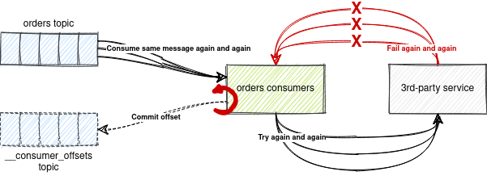
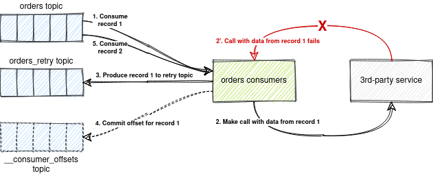
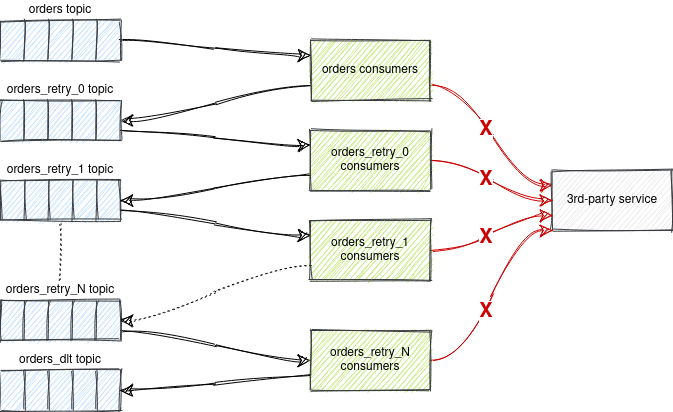

# Spring Kafka Non-Blocking Retries and Dead Letter Topics

* [Introduction](#0b79795d3efc95b9976c7c5b933afce2)
* [Simple Blocking Retries](#6fd65dea9dbf381660d8d2d9d6ec86b7)
* [How to Properly Implement a Back Off Delay?](#10dc1e1086f0a4cb592bdd2602fbb311)
* [Non-Blocking Retries and Dead Letter Topics](#c6e2fbe6911aecebfba6dbcb786408eb)
    * [Advantages](#f7b2ceb71d1db781418644d81e747782)
    * [Disadvantages](#90843c066e7c75581a9005b9579c151d)
* [Recoverable vs Non-Recoverable Errors](#c02cd12315c42e2e126b7b3693fe7f25)
* [Topic Naming for Multiple Consumer Groups](#217c291a5e1269cdf1dc29e841471115)
* [Non-Blocking Retries in Spring Kafka](#7a84b9ef94c90d8886f0216d9da2e66f)
* [How to Run the Sample?](#53af957fc9dc9f7083531a00fe3f364e)

## <a name="0b79795d3efc95b9976c7c5b933afce2"></a>Introduction

This repository provides a sample of non-blocking retries and dead letter topics
(aka [reliable reprocessing and dead letter queues](https://eng.uber.com/reliable-reprocessing/))
with Apache Kafka. The sample is implemented using Spring Boot and Spring Kafka.

## <a name="6fd65dea9dbf381660d8d2d9d6ec86b7"></a>Simple Blocking Retries

A reliable distributed system can hardly be built without reprocessing failed messages.

Kafka doesn't provide retry and dead letter topic functionality out of the box.

Retries can be quickly and simply implemented at the consumer side. The consumer thread is
suspended (according to a backoff policy), and the failed message is reprocessed without doing calls
to `Consumer.poll()` during the retries.



Retrying at the client side has the following disadvantages

* Blocked batch processing. When we need to process a large number of messages in real time,
  repeatedly failed messages can block batch processing. Messages consistently exceeding the retry
  limit take the longest time to process and use the most resources. Without a success response, the
  Kafka consumer will not commit a new offset and the batches with these bad messages would be
  blocked, as they are re-consumed again and again.
* Difficulty retrieving metadata about retries. Retrieving metadata about retries such as timestamps
  and the number of retry can be difficult.

## <a name="10dc1e1086f0a4cb592bdd2602fbb311"></a>How to Properly Implement a Back Off Delay?

A naive solution (*not working!*) for implementing a back off delay (delayed message processing) is
by sleeping the consumer thread till due time (time the message was published to the topic + delay
time).

This approach doesn't work because you cannot sleep the consumer thread as Kafka will assume that it
is dead and will perform partition reassignment and pass that message to other consumers.

Kafka has two properties to determine consumer health. The `session.timeout.ms` is used to determine
if the consumer is active. Since kafka-clients version 0.10.1.0, heartbeats are sent on a background
thread, so a slow consumer no longer affects that. `max.poll.interval.ms` (default: 5 minutes) is
used to determine if a consumer appears to be hung (taking too long to process records from the last
poll). If the time between `poll()` calls exceeds this, the broker revokes the assigned partitions
and performs a rebalance. For lengthy retry sequences, with back off, this can easily happen.

A Kafka consumer must be paused and resumed instead of sleeping the thread.

The delayed topic consumer must check the timestamp, and if it's not due, pause the consumption
without committing the offset for that topic's partition. When it is due, the partition consumption
is resumed, and the message is consumed again.

Delay precision is guaranteed on a best-effort basis. If one message's processing takes longer than
the next message's back off period for that consumer, the next message's delay will be higher than
expected. But it is guaranteed that a message will never be processed before its due time.

## <a name="c6e2fbe6911aecebfba6dbcb786408eb"></a>Non-Blocking Retries and Dead Letter Topics

Request reprocessing (retries) must be non-blocking (done in separate topics) and delayed:

* to not disrupt real-time traffic;
* to not amplify the number of calls, essentially spamming bad requests;
* for observability (to obtain metadata on the retries).

Achieving non-blocking retry and DLT functionality with Kafka usually requires setting up extra
topics and creating and configuring the corresponding listeners.



Errors trickle down levels of retry topics until landing in the DLT:

* If message processing fails, the message is forwarded to a retry topic with a back off timestamp.
* The retry topic consumer then checks the timestamp and if it's not due it pauses the consumption
  for that topic's partition.
* When it is due the partition consumption is resumed, and the message is consumed again.
* If the message processing fails again the message will be forwarded to the next retry topic, and
  the pattern is repeated until a successful processing occurs, or the attempts are exhausted,
* If all retry attempts are exhausted the message is sent to the Dead Letter Topic for visibility
  and diagnosis.
* Dead letter Topic messages can be reprocessed by being published back into the first retry topic.
  This way, they have no influence of the live traffic.



It is important not to simply re-attempt failed requests immediately one after the other. Doing so
will amplify the number of calls, essentially spamming bad requests.

### <a name="f7b2ceb71d1db781418644d81e747782"></a>Advantages

Unblocked batch processing. Failed messages enter their own designated channels, enabling successes
in the same batch to proceed instead of requiring them to be reprocessed along with the failures.
Thus, consumption of incoming requests moves forward unblocked, achieving higher real-time
throughput.

### <a name="90843c066e7c75581a9005b9579c151d"></a>Disadvantages

By using non-blocking retries you lose Kafka's ordering guarantees for that topic.

## <a name="c02cd12315c42e2e126b7b3693fe7f25"></a>Recoverable vs Non-Recoverable Errors

We can also differentiate treatment of different types of errors, allowing cases such as network
errors to be re-attempted, while null pointer exceptions and other code bugs should go straight into
the DLT because retries would not fix them.

## <a name="217c291a5e1269cdf1dc29e841471115"></a>Topic Naming for Multiple Consumer Groups

If there are more than one consumer group, retry and DLT topics names have to include the consumer
group ID, e.g. `orders-myConsumerGroup1-retry-0`.

Such naming is required because there can be multiple applications consuming from the same topics
with different consumer group IDs, and reprocessing of failed messages must be independent for
different consumer groups.

For example, application A have processed a message successfully, while application B failed to
process the same message. This message must be reprocessed only by application A. Application B must
not consume this message from the retry topic because it has already successfully processed it.

## <a name="7a84b9ef94c90d8886f0216d9da2e66f"></a>Non-Blocking Retries in Spring Kafka

Since Spring Kafka 2.7.0 failed deliveries can be forwarded to a series of topics for delayed
redelivery.

It can described with an example:

```java
public class RetryableKafkaListener {

  @RetryableTopic(
      attempts = "4",
      backoff = @Backoff(delay = 1000, multiplier = 2.0),
      autoCreateTopics = "false",
      topicSuffixingStrategy = TopicSuffixingStrategy.SUFFIX_WITH_INDEX_VALUE)
  @KafkaListener(topics = "orders")
  public void listen(String in, @Header(KafkaHeaders.RECEIVED_TOPIC) String topic) {
    log.info(in + " from " + topic);
    throw new RuntimeException("test");
  }

  @DltHandler
  public void dlt(String in, @Header(KafkaHeaders.RECEIVED_TOPIC) String topic) {
    log.info(in + " from " + topic);
  }
}
```

With this `@RetryableTopic` configuration, the first delivery attempt fails and the record is sent
to a topic `order-retry-0` configured for a 1-second delay. When that delivery fails, the record is
sent to a topic `order-retry-1` with a 2-second delay. When that delivery fails, it goes to a
topic `order-retry-2` with a 4-second delay, and, finally, to a dead letter topic `orders-dlt`
handled by `@DltHandler` method.

The first attempt counts against the `maxAttempts`, so if you provide a `maxAttempts` value of 4
there'll be the original attempt plus 3 retries.

Non-blocking retries allow processing of subsequent records from the same partition while retrying
the failed record.

## <a name="53af957fc9dc9f7083531a00fe3f364e"></a>How to Run the Sample?

1. Download & install OpenJDK 11 (LTS) at [AdoptOpenJDK](https://adoptopenjdk.net/).
2. Build the sample and run all tests
   ```bash
   ./gradlew clean test -i
   ```
   By default, embedded Kafka broker is started at port `19092`. You can set a port for the embedded
   Kafka broker using `kafka.embedded.port` property
   ```bash
   ./gradlew clean test -i -Dkafka.embedded.port=29092
   ```
